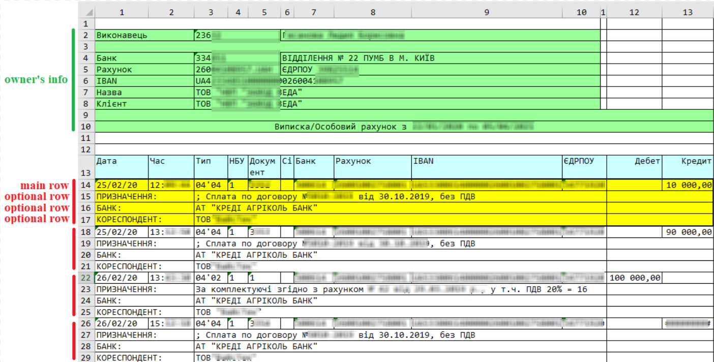
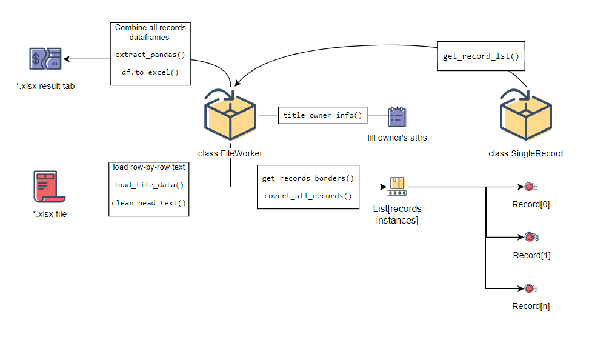
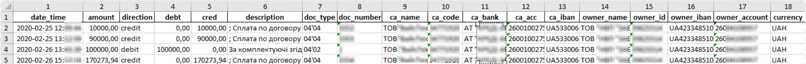

# Normalizing multiple-row-record in a table (bank statement example)

## Subject description

### Goal

Get a table with normalized records. One record corresponds to one row.

### Original Excel file

Transaction information has been stored in several rows. The second and subsequent rows are optional. This format 
does not allow sorting or selection. Also, the optional rows have merged cells, which complicates the easy *pandas* 
application.

## Solution

- Load file in text representation (row-by-row).
- Separate the column layout with a tab symbol.
- Define boundaries between records by keywords.  
- Extract main row data in each record.
- Find optional rows within record boundaries.
- Сombine the attributes of a record into a single instance.
- Pass array of records to pandas dataframe, export to excel tab.

## Result file

## Console hints

Added some console features - *tqdm* progress bar and *rich* table print:

